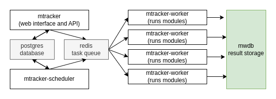
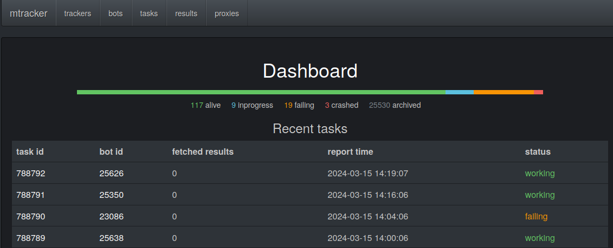

# mtracker

Mtracker is a system dedicated to tracking malware C2 servers and automatically downloading actionable information from them. 

Mtracker receives "configurations" that are used to create "trackers". Each tracker tries to connect to C2 using the provided configuration (C2 address, host, port, etc) and download more binaries, commands or data.

Logically, mtracker is divided into several components:



The user-visible component is the mtracker web interface, which provides
a HTTP UI and API:



The second most important component are workers, which communicate with
the interface using redis task queue (using [rq](https://python-rq.org/docs/)), and execute the tasks.

Finally there is a scheduler, that makes sure tasks are executed in a regular intervals.

All the components communicate through the shared postgres database to manage the state, but the results are only uploaded to [mwdb-core](https://github.com/CERT-Polska/mwdb-core/). Mtracker is tightly tied to MWDB. Users who want to customize this behaviour and use another backend need to override the BotModule class and provide their own implmentation of appropriate methods.

### Installation: docker compose

The easiest way to setup mtracker is using a provided docker compose file

```bash
docker compose build
cp .env.dist .env
vim .env  # set mwdb token and proxy configuration
mkdir src/private_modules  # a place for your modules
echo "trackers = {}" > src/private_modules/__init__.py  # empty module list
docker compose up # You can use '-d' to detach

# finally, in another tab apply migrations from db/folder in order, using:
docker compose exec -T postgres psql -U mtracker3 --dbname mtracker3 < db/000_init.sql
docker compose exec -T postgres psql -U mtracker3 --dbname mtracker3 < db/001_bots_tasks.sql
docker compose exec -T postgres psql -U mtracker3 --dbname mtracker3 < db/002_update_bots.sql
docker compose exec -T postgres psql -U mtracker3 --dbname mtracker3 < db/003_bots_add_last_error.sql
docker compose exec -T postgres psql -U mtracker3 --dbname mtracker3 < db/004_bots_add_family.sql
docker compose exec -T postgres psql -U mtracker3 --dbname mtracker3 < db/005_results.sql
docker compose exec -T postgres psql -U mtracker3 --dbname mtracker3 < db/006_add_proxy.sql
docker compose exec -T postgres psql -U mtracker3 --dbname mtracker3 < db/007_alter_proxy_add_username_password.sql
```

You can now access the web interface on port 80.

### Installation: bare metal

You can also install mtracker like you would install any other Python package:

```
# Assuming mtracker is cloned into /opt/mtracker directory
# And your modules are stored in /opt/mtrackermodules
# Ensure you have postgres and redis running
cp /opt/mtracker/mtracker.example.ini /opt/mtracker/mtracker.ini
# Edit the config, especially mwdb_token, Db config, Redis config, and ProxyConfig
pip install /opt/mtracker
pip install -r /opt/mtrackermodules/requirements.txt
python3 -m mtracker.worker /opt/mtrackermodules/ # start worker process
python3 -m mtracker.server  # in another shell, start the server
python3 -m mtracker.scheduler  # in another shell, start the scheduler
```

### Installation: proxy configuration

Mtracker needs proxy servers to work. There are two ways to configure proxies:

* Set proxy.method to "file", and proxy.path to a json file.
* Set proxy.method to "url", and proxy.url to a url that returns a json.

In both cases, the JSON should look like this (additional fields are allowed):
```json
[
  {
    "host": "10.0.0.1234",
    "port": 9050,
    "password": "",
    "username": "",
    "country": "pl"
  },
  // more proxies in the same format
]
```

All the proxies are SOCKS5h proxies. If you don't want to host your own proxies, the easiest solution is to proxy traffic through tor. 

Remember that after starting mtracker you need to go to /proxies endpoint and click "update" for your configuration to have any effect.

### Module development

Mtracker is just a framework, and **won't work** without implementing modules. See [the documentation](docs/moduledev.md) for more information about module development.

### Contact

If you have any problems, bugs or feature requests related to mquery, you're
encouraged to create a GitHub issue.

You can chat about this project on Discord:

[](https://discord.gg/3FcP6GQNzd)

If you have questions unsuitable for Github or discord, you can email CERT.PL
(info@cert.pl) directly.

### Acknowledgements

This project was created and is maintained by [CERT Polska](https://cert.pl/en/).

Additional thanks to [Checkpoint Research](https://research.checkpoint.com), especially [@ITAYC0HEN](https://github.com/ITAYC0HEN),
who contributed to the development and testing of mtracker
